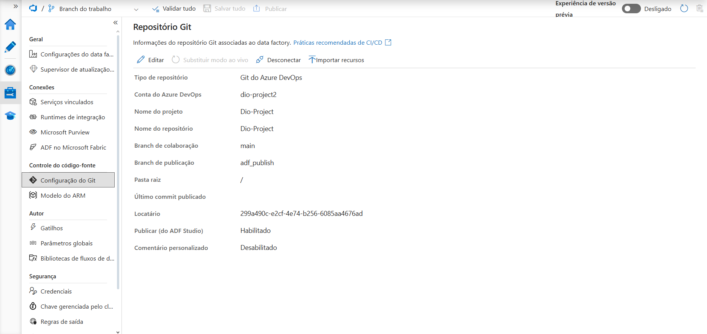
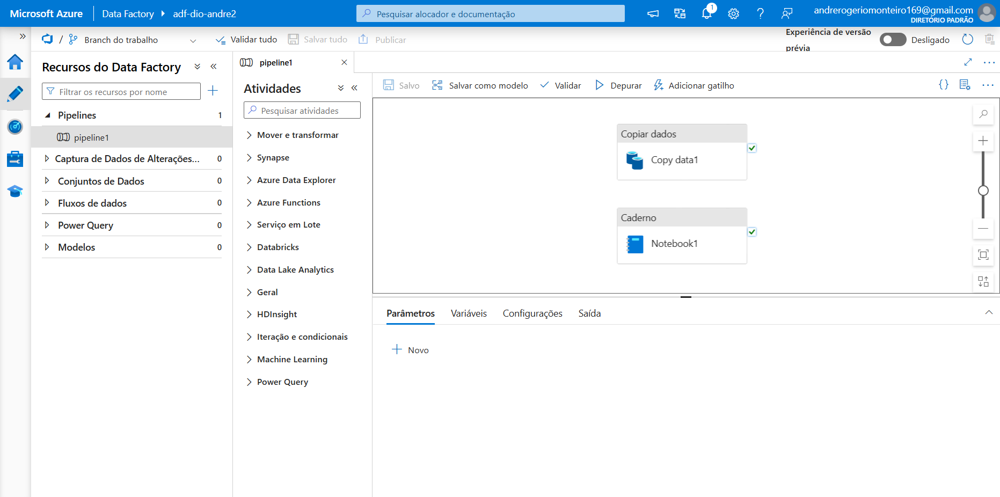
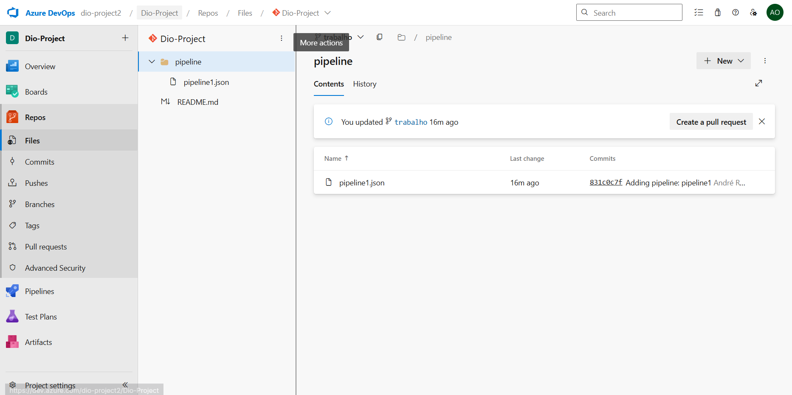
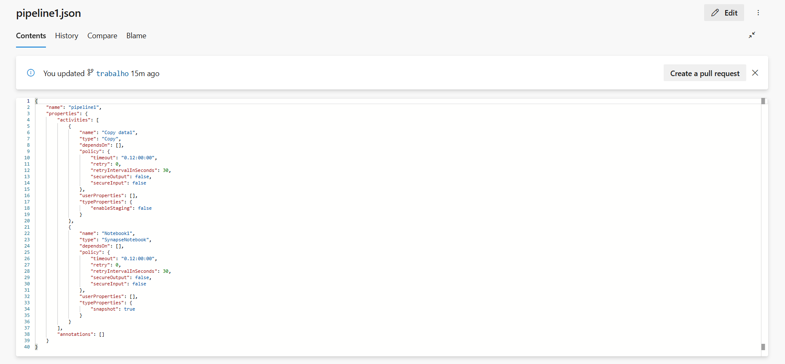

# azure-data-factory-devops
# Integração Azure Data Factory ↔ Azure DevOps

Este repositório comprova a integração entre **Azure Data Factory** e **Azure DevOps**, com versionamento de um pipeline simples.

## Imagens de Comprovação

1. **Git configurado no Data Factory (Dio-Project, branch trabalho)**  
   

2. **Criação do pipeline dentro do data factory**  
   

3. **Pipeline guardado dentro do repositorio**  
   

3. **Alterações feitas no pipeline sendo guardadas**  
   
---
